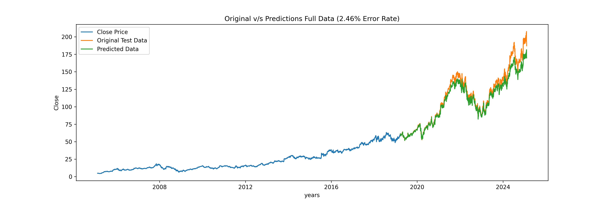
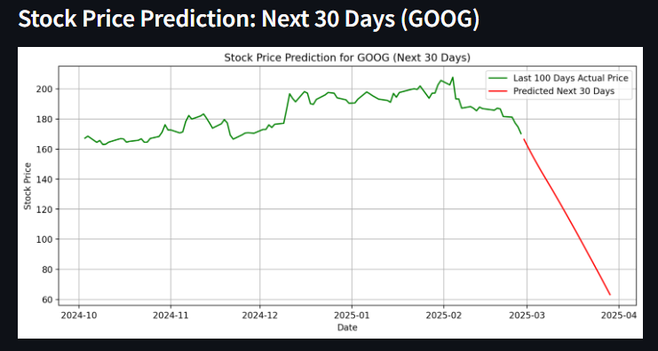

# 📈 STOCK PREDICTOR

A machine learning-based web application that predicts future stock prices using historical data. Built with Python, Keras, and Flask, this project leverages deep learning to forecast trends in stock markets.

---

## 🚀 Features

- 📊 Stock price prediction using a trained neural network model.
- 💡 Simple and intuitive web interface for user interaction.
- 🧠 Pre-trained Keras model for quick deployment.
- 🔧 Easily customizable and extendable for different stocks or datasets.

---

## 🛠️ Tech Stack

- **Frontend**: HTML, CSS, Bootstrap (if applicable)
- **Backend**: Python (Flask)
- **Machine Learning**: Keras, TensorFlow
- **Data Handling**: NumPy, Pandas, Scikit-learn
- **Visualization**: Matplotlib

---

## 📁 Project Structure

```
STOCK-PREDICTOR/
│
├── app.py                   # Main Flask app script
├── a.py                     # Data preprocessing / model utilities
├── stock_price_model.keras # Trained Keras model
├── requirements.txt         # Python dependencies
└── README.md                # Project documentation
```

---

## ⚙️ Installation

To run this project locally:

1. **Clone the repository**
```bash
git clone https://github.com/satwikshirsat04/STOCK-PREDICTOR.git
cd STOCK-PREDICTOR
```

2. **Install required dependencies**
```bash
pip install -r requirements.txt
```

3. **Run the application**
```bash
python app.py
```

4. Open your browser and navigate to `http://127.0.0.1:5000` to access the web app.

---

## 📈 How It Works

1. Historical stock data is collected and preprocessed.
2. A deep learning model (likely an LSTM) is trained to identify price patterns.
3. The user can interact with the web app to view predictions.
4. Model forecasts the next potential closing price based on trends.

---

## 🧪 Model Training (Optional)

If you'd like to retrain the model:

- Modify `a.py` to preprocess and prepare the dataset.
- Use Keras to define and train the model architecture.
- Save the trained model as `stock_price_model.keras`.

---

## 📷 Screenshots
### 🔹 Training 

### 🔹 Google Stock


### 🔹 Prediction Result


---

## 📌 Future Improvements

- 🔄 Live data fetching via APIs (e.g., Yahoo Finance, Alpha Vantage)
- 📉 Real-time chart visualizations
- 📱 Mobile-friendly UI design
- 🧠 Enhanced model accuracy with more features (volume, technical indicators)

---

## 🤝 Contributing

Contributions, issues, and feature requests are welcome!  
Feel free to check the [issues page](https://github.com/satwikshirsat04/STOCK-PREDICTOR/issues) if you'd like to collaborate.

---


## 👨‍💻 Author

**Satwik Shirsat**  
[GitHub](https://github.com/satwikshirsat04)
